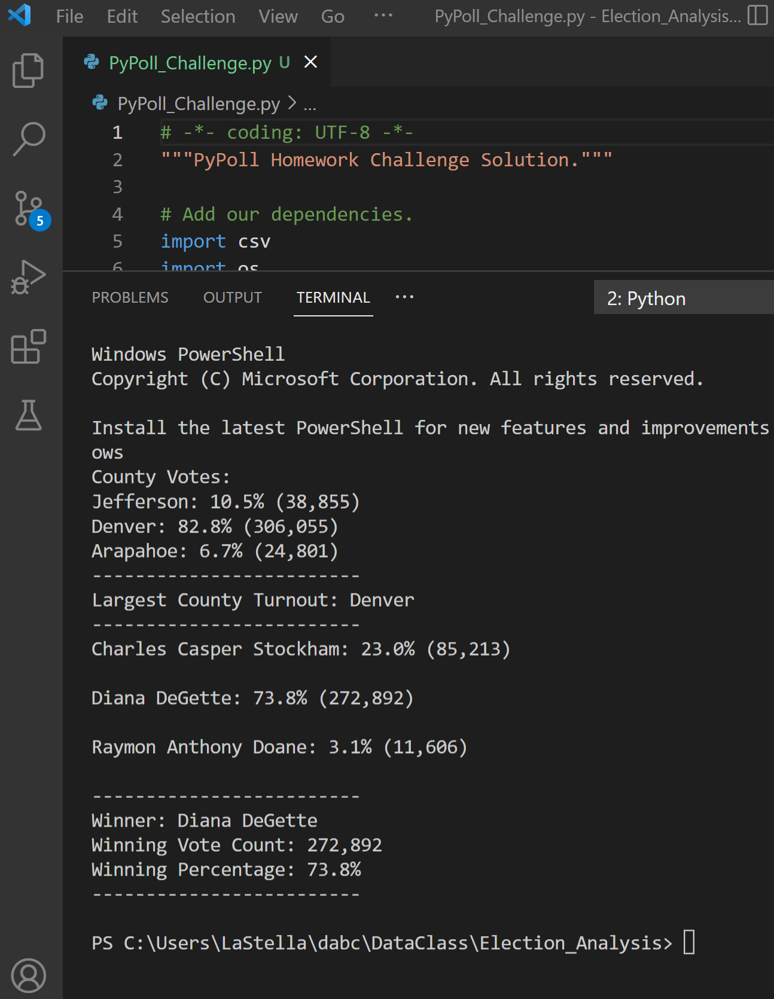

# Election_Analysis
DABC Module 3.

## Project Overview

- Total number of votes cast
- A complete list of candidates who received votes
- Total number of votes each candidate received
- Percentage of votes each candidate won
- The winner of the election based on popular vote

## Resources
- Data Source: election_results.csv
- Software: Python 3.10.5, Visual Studio 1.68.1

## Summary
The election results from the analysis:

- Total Votes: 369,711

- Charles Casper Stockham: 23.0% (85,213)
- Diana DeGette: 73.8% (272,892)
- Raymon Anthony Doane: 3.1% (11,606)

  - Winner: Diana DeGette
  - Winning Vote Count: 272,892
  - Winning Percentage: 73.8%

__________

# Election_Analysis

2022-07-09

LaStella, Laurina

DABC Module 3.

# 1. Overview of Election Audit

- Read data from a CSV file.
- Use `for` loops.
- Use conditional statements.
- Calculate: 
    - Candidate vote totals and percentages. 
    - Winner totals and percentages.
    - County totals and percentages. 

# 2. Election-Audit Results

- How many votes were cast in this congressional election?  
**369,711**
- Provide a breakdown of the number of votes and the percentage of total votes for each county in the precinct.  
**County Votes:  
Jefferson: 10.5% (38,855)  
Denver: 82.8% (306,055)  
Arapahoe: 6.7% (24,801)**

- Which county had the largest number of votes?  
**Largest County Turnout: Denver**

- Provide a breakdown of the number of votes and the percentage of the total votes each candidate received.  
**Charles Casper Stockham: 23.0% (85,213)  
Diana DeGette: 73.8% (272,892)  
Raymon Anthony Doane: 3.1% (11,606)**

- Which candidate won the election, what was their vote count, and what was their percentage of the total votes?  
**Winner: Diana DeGette  
Winning Vote Count: 272,892  
Winning Percentage: 73.8%**   

# 3. Election-Audit Summary
Two ways this script can be used for any election:
1. A variety of geographic areas such as County, ZIP Code, Census Block, etc. can be included in the data file. Each can be analysed and displayed separately.
2. A variety of different offices, with multiple candidates for each, can be included in the data file. Each can be analysed and displayed separately.

